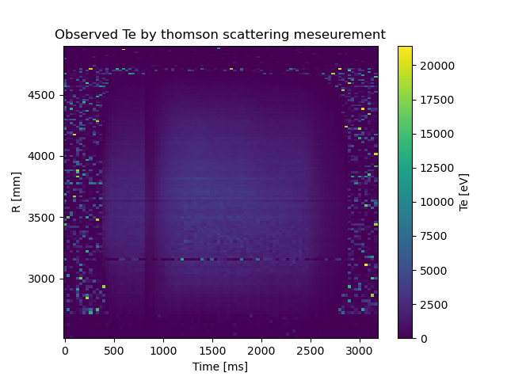

.. _demo_thomson:

Electron temperature profile
============================

.. literalinclude:: ../../../../demos/anadata/thomson.py

output in std:
.. code-block::

    <xarray.Dataset>
    Dimensions:       (Time: 96, R: 137)
    Coordinates:
    * Time          (Time) float64 0.0 33.0 66.0 ... 3.1e+03 3.133e+03 3.166e+03
    * R             (R) float64 2.525e+03 2.55e+03 ... 4.884e+03 4.895e+03
    Data variables:
        Te            (Time, R) float64 84.0 0.0 38.0 47.0 ... 5.0 73.0 5.0 125.0
        dTe           (Time, R) float64 2.178e+04 0.0 40.0 ... 2.178e+04 2.178e+04
        n_e           (Time, R) float64 9.0 138.0 16.0 4.0 ... 38.0 11.0 0.0 16.0
        dn_e          (Time, R) float64 8.0 63.0 7.0 6.0 7.0 ... 13.0 8.0 11.0 7.0
        laser         (Time, R) float64 5.209e+03 5.209e+03 ... 4.373e+03 4.373e+03
        laser number  (Time, R) float64 5.0 5.0 5.0 5.0 5.0 ... 1.0 1.0 1.0 1.0 1.0
    Attributes:
        diagnostics:  thomson
        description:  density (ne) is only for very rough information\nDo not use...

.. figure:: thomson.png
    :align: center

    **Caption:** Electron temperature profiles measured by thomson scattering mesurements
    varied from 1000 to 1100 [msec] are plotted.

    **Caption:** Electron temperature profiles in 2D image.