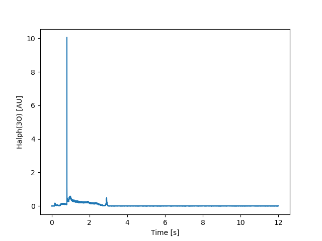

****************
Quickstart Guide
****************

.. _list of analyzed data:     http://kaiseki-dev.lhd.nifs.ac.jp/documents/diagnostics/dataname.shtml
.. _search for registerd data: http://egdb.lhd.nifs.ac.jp/dataexplog/registered_data.html

======================
Retrieve analyzed data
======================

At first generate :py:class:`AnaData` instance:

.. prompt:: python >>> auto

    >>> from nifs.anadata import AnaData
    >>> ana = AnaData(80000, 1)

If you would like to search for registerd diagnostics in the kaiseki-server,
:py:meth:`AnaData.diagnostics_list` method is useful which returns a dict of
key: diagnostics name and value: description:

.. prompt:: python >>> auto

    >>> ana.diagnostics_list()
    {'ha1': 'Time behaviors of visible lines of Halpha and HeI',
     'ech': 'Wave form of ECH pulse',
     'nb1pwr': 'NBI power of BL1',
     'imp01': 'Line intensities of Lyman-alpha and some impurity ions',
     'wp': 'Plasma stored energy estimated by diamagnetic flux measurement',...
    }

As another options,
diagnostics names are availabe from a `list of analyzed data`_
or the `search for registerd data`_ site.

If you would like to retrieve "ha1" diagnostics dataset,
use :py:meth:`AnaData.retrieve`:

.. prompt:: python >>> auto

    >>> dataset = ana.retrieve("ha1")
    >>> dataset
    <xarray.Dataset>
    Dimensions:        (Time: 12001)
    Coordinates:
    * Time           (Time) float64 0.0 0.001 0.002 0.003 ... 12.0 12.0 12.0 12.0
    Data variables:
        Halph(3O)      (Time) float64 -0.00378 0.001103 ... 0.001103 0.001103
        HeI(3O)        (Time) float64 0.00252 -0.002363 ... -0.002363 -0.002363
        Halph(ImpMon)  (Time) float64 0.002835 0.002835 ... -0.002048 0.002835
        HeI(Impmon)    (Time) float64 0.002835 0.002835 ... -0.002048 -0.002048
    Attributes:
        diagnostics:  ha1
        description:  summary_data\n
    
Using a xarray.plot method allows us to make a simple graph.

.. prompt:: python >>> auto

    >>> from matplotlib import pyplot as plt
    >>>
    >>> ds = ana.retrieve("ha1")
    >>> ds["Halpha(3O)"].plot()
    >>> plt.show()

=================
Retrieve raw data
=================
comming soon...
